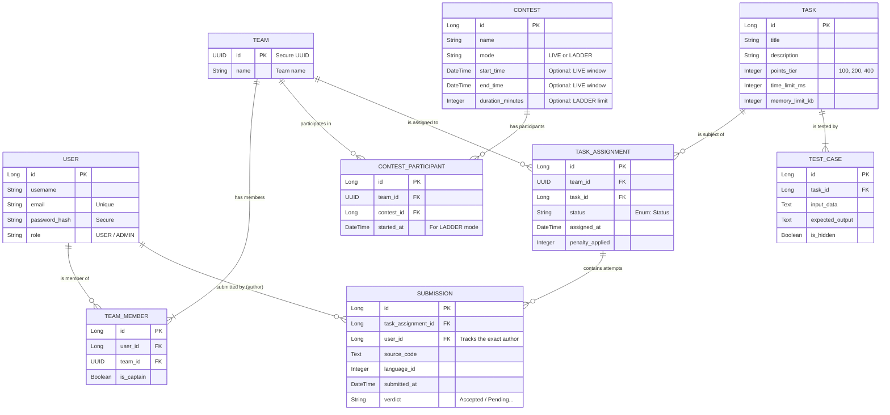

# Database Architecture

This diagram represents the Entity-Relationship (ER) model for the Coding Arena database.

```mermaid
erDiagram
    USER ||--o{ TEAM_MEMBER : "is member of"
    TEAM ||--|{ TEAM_MEMBER : "has members"
    TEAM ||--o{ CONTEST_PARTICIPANT : "participates in"
    CONTEST ||--o{ CONTEST_PARTICIPANT : "has participants"
    TEAM ||--o{ TASK_ASSIGNMENT : "is assigned to"
    TASK ||--o{ TASK_ASSIGNMENT : "is subject of"
    TASK ||--|{ TEST_CASE : "is tested by"
    TASK_ASSIGNMENT ||--o{ SUBMISSION : "contains attempts"
    USER ||--o{ SUBMISSION : "submitted by (author)"

    USER {
        Long id PK
        String username
        String email "Unique"
        String password_hash "Secure"
        String role "USER / ADMIN"
    }

    TEAM {
        UUID id PK "Secure UUID"
        String name "Team name"
    }

    TEAM_MEMBER {
        Long id PK
        Long user_id FK
        UUID team_id FK
        Boolean is_captain
    }

    CONTEST {
        Long id PK
        String name
        String mode "LIVE or LADDER"
        DateTime start_time "Optional: LIVE window"
        DateTime end_time "Optional: LIVE window"
        Integer duration_minutes "Optional: LADDER limit"
    }

    CONTEST_PARTICIPANT {
        Long id PK
        UUID team_id FK
        Long contest_id FK
        DateTime started_at "For LADDER mode"
    }

    TASK {
        Long id PK
        String title
        String description
        Integer points_tier "100, 200, 400"
        Integer time_limit_ms
        Integer memory_limit_kb
    }

    TEST_CASE {
        Long id PK
        Long task_id FK
        Text input_data
        Text expected_output
        Boolean is_hidden
    }

    TASK_ASSIGNMENT {
        Long id PK
        UUID team_id FK
        Long task_id FK
        String status "Enum: Status"
        DateTime assigned_at
        Integer penalty_applied
    }

    SUBMISSION {
        Long id PK
        Long task_assignment_id FK
        Long user_id FK "Tracks the exact author"
        Text source_code
        Integer language_id
        DateTime submitted_at
        String verdict "Accepted / Pending..."
    }
```